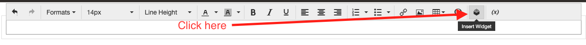
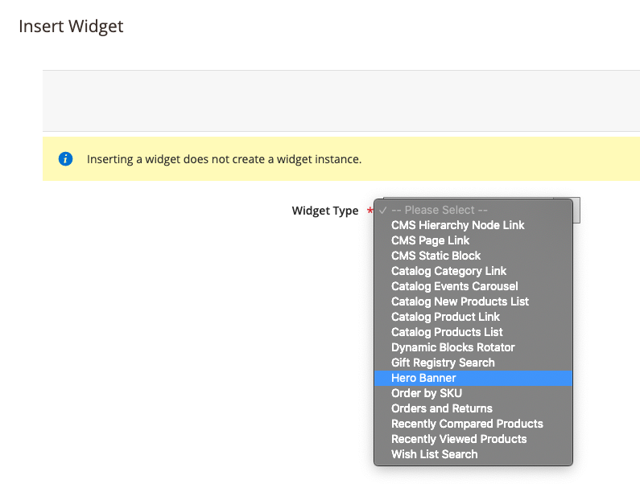
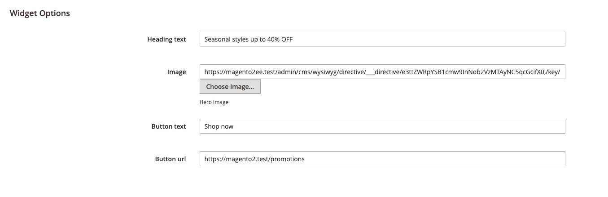

# Magento 2  Hero Banner extension

Magento 2 extension that allows administrators to create Hero Banners.

 

Administrators can inject Hero banners for any CMS Page or CMS block by Creating the Hero Banner CMS Widget.

## How to insert widget to CMS Page

1. Step 1: Open CMS Page/Block
1. Step 2: CLick "Insert widget" In WYSIWYG Editor   
1. Step 3: Select "Hero banner" from the drop-down list 
1. Step 4: Fill in all the fields and add an image 
1. Step 6: Save the widget
1. Step 5: Save the CMS Page

Note: The above instruction also applies to CMS blocks.

## Installation

`composer require marcinkwiatkowski/hero-banner`

## Magento platform compatibility

Open Source (CE): 2.3.x, 2.4.x
Commerce (EE): 2.3.x, 2.4.x

## Contribution

Feel free to Fork and contrinute to this module and create a pull request so i will merge your changes to main branch.
If you have any questions/suggestions, please create an issue. 
